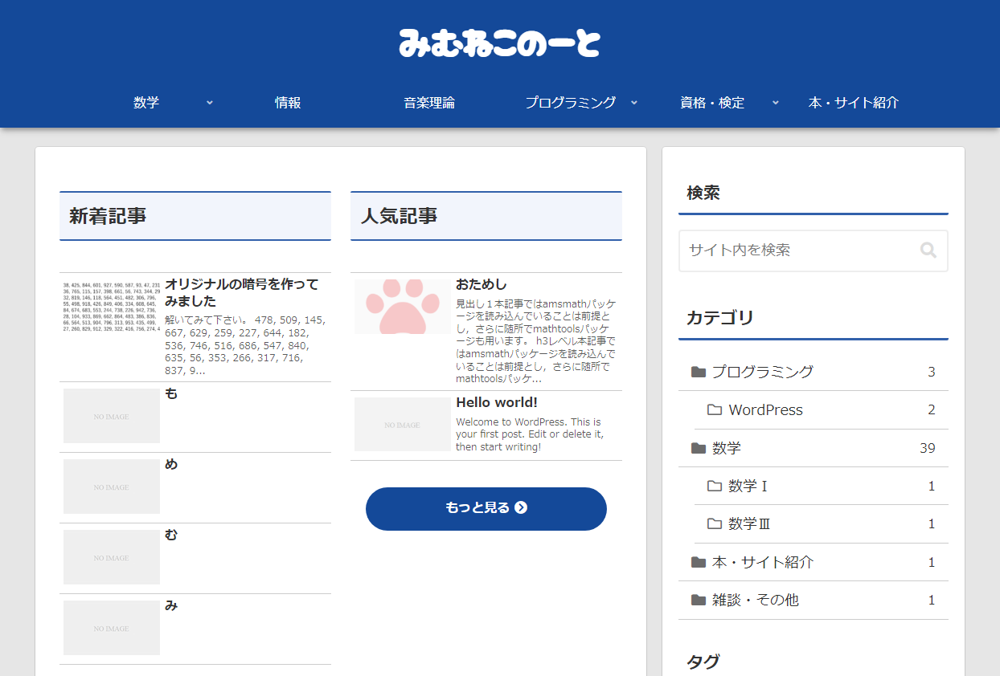

# Kiss-Skins
WordPressテーマ[Cocoon](https://wp-cocoon.com/)用オリジナルスキン「Kiss」シリーズ。

# 特長
- シンプルで機能的
- 統一感の作り出す美しさ
- 豊富なカラーバリエーション
- ダークモードに対応したレスポンシブデザイン

# ラインナップ（全10色）
- [Kiss-Red](#Kiss-Red)
- [Kiss-Green](#Kiss-Green)
- [Kiss-Blue](#Kiss-Blue)
- [Kiss-Yellow](#Kiss-Yellow)
- [Kiss-Purple](#Kiss-Purple)
- [Kiss-Pink](#Kiss-Pink)
- [Kiss-Orange](#Kiss-Orange)
- [Kiss-Brown](#Kiss-Brown)
- [Kiss-Gray](#Kiss-Gray)
- [Kiss-Black](#Kiss-Black)

## Kiss-Red
> [!NOTE]
> 赤色を基調としたスキン

## Kiss-Green
> [!NOTE]
> 緑色を基調としたスキン

## Kiss-Blue
> [!NOTE]
> 青色を基調としたスキン

## Kiss-Yellow
> [!NOTE]
> 黄色を基調としたスキン

## Kiss-Purple
> [!NOTE]
> 紫色を基調としたスキン

## Kiss-Pink
> [!NOTE]
> 桃色を基調としたスキン

## Kiss-Orange
> [!NOTE]
> 橙色を基調としたスキン

## Kiss-Brown
> [!NOTE]
> 茶色を基調としたスキン

## Kiss-Gray
> [!NOTE]
> 灰色を基調としたスキン

## Kiss-Black
> [!NOTE]
> 黒色を基調としたスキン

# 更新
- 2024/03/17 リポジトリ作成
